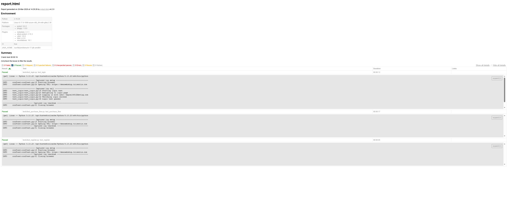

# Hybrid QA Automation Framework (UI + API + CI/CD)


[](https://cyphermorgan.github.io/demowebshop-e2e-selenium-pytest/)


Production-style **Hybrid QA Automation Framework** combining:

- UI Automation (Selenium + PyTest)
- API Testing (Python requests)
- Postman Collections (Newman)
- CI/CD (GitHub Actions)
- Allure Reporting

Designed to simulate **real-world QA workflows** with scalable architecture, environment-driven execution, and stable CI pipelines.

This project demonstrates a **real-world, production-ready test automation framework** for end-to-end testing of the Demo Web Shop application.

---

# 🚀 Tech Stack

* **Python**
* **Selenium WebDriver**
* **PyTest**
* **PyTest-xdist (parallel execution)**
* **PyTest HTML Reports**
* **Allure Reporting (merged + history)**
* **PyTest-rerunfailures (flaky test handling)**
* **Page Object Model (POM)**
* **GitHub Actions (CI/CD)**
* **Logging Framework**
* **Requests (API testing)**
* **Postman + Newman**
* **Hybrid Testing (UI + API)**

---

# 🧱 Framework Architecture

The framework follows a layered, scalable design:

```
Tests
   ↓
Page Objects
   ↓
Core Framework (Driver, Waits, Utilities)
   ↓
Configuration + Test Data
```

### Design Principles

* Page Object Model (POM)
* Separation of concerns
* Reusable utilities
* Environment-driven execution
* CI/CD ready
* Flaky-test resistant design

---

# 📁 Project Structure

```
demowebshop-e2e-selenium-pytest
│
├── .github/workflows
│   └── tests.yml
│
├── config
│   ├── config.yaml
│   └── config_reader.py
│
├── core
│   ├── driver_factory.py
│   └── exceptions.py
│
├── data
│   ├── users.json
│   └── products.json
│
├── pages
│   ├── base_page.py
│   ├── login_page.py
│   ├── register_page.py
│   ├── home_page.py
│   ├── search_page.py
│   ├── product_page.py
│   ├── cart_page.py
│   ├── checkout_page.py
│   └── order_page.py
│
├── api_tests
│   ├── test_login_api.py
│   └── test_user_api.py
│
├── tests
│   ├── test_login.py
│   ├── test_register.py
│   └── test_purchase_flow.py
│
├── tests_hybrid
│   └── test_ui_api_flow.py
│
├── utils
│   ├── logger.py
│   ├── screenshot.py
│   ├── wait_utils.py
│   ├── data_loader.py
│   └── api_client.py
│
├── postman
│   └── collection.json
│
├── reports
│   ├── logs/
│   ├── screenshots/
│   └── allure-results/
│
├── conftest.py
├── pytest.ini
├── requirements.txt
└── README.md
```

---

# ⚙️ Features

* Page Object Model implementation
* Environment-driven configuration (YAML + environment variables)
* Multi-browser execution (Chrome + Firefox)
* Retry mechanism for flaky tests
* Allure reporting with merged results and history
* CI/CD integration with GitHub Actions
* Parallel test execution (`pytest-xdist`)
* Centralized driver factory (CI-safe)
* Logging system
* Screenshot capture on failure
* HTML + Allure reporting
* Retry mechanism for flaky tests
* Stable execution in headless environments
* API testing layer with reusable client
* Hybrid UI + API test flows
* Postman collection execution via Newman
* CI-safe API fallback mechanism (no external failures)

---

# 🧪 Automated Test Scenarios

### 🔐 Login Test

* Navigate to login page
* Enter valid credentials
* Verify successful login

---

### 🧾 User Registration

* Register new user with random email
* Verify registration success message

---

### 🛒 Purchase Flow (E2E)

* Login
* Clear cart (state isolation)
* Search product
* Open product page
* Add to cart (with retry handling)
* Proceed to checkout
* Verify checkout page

---

# 🌐 API Testing

The framework includes a reusable API layer built using `requests`.

### Features:
* Centralized API client
* Environment-based API switching
* Stable execution in CI (httpbin fallback)
* Positive and negative test coverage

### Example:

```bash
pytest api_tests
```

---

# 🔄 Hybrid Testing (UI + API)

Hybrid tests combine API and UI validation in a single flow.

### Example Flow:
1. Fetch data via API
2. Use data in UI test
3. Validate application behavior

### Benefits:
* End-to-end validation
* Real-world QA simulation
* Reduced dependency on UI setup

---

# 📮 Postman Integration

The framework includes a Postman collection executed via Newman.

### Run collection:

```bash
newman run postman/collection.json
```

---

# 🛠 Installation

Clone the repository:

```bash
git clone https://github.com/CypherMorgan/demowebshop-e2e-selenium-pytest.git
```

Navigate into the project:

```bash
cd demowebshop-e2e-selenium-pytest
```

Install dependencies:

```bash
pip install -r requirements.txt
```

---

# ▶️ Run Tests

### Run all tests:

```bash
pytest
```

### Run with browser:

```bash
pytest --browser=chrome
pytest --browser=firefox
```

### Run in parallel:

```bash
pytest -n 2
```

### Run with HTML report:

```bash
pytest --html=reports/report.html --self-contained-html
```

### Run with Allure:

```bash
pytest --alluredir=reports/allure-results
```

---

# 📊 Reporting

## HTML Report

Generated at:

```
reports/report.html
```

## Allure Report

Generate & view:

```bash
allure serve reports/allure-results
```

Includes:

* Merged results (Chrome + Firefox)
* Historical trends
* Execution steps
* Screenshots
* Test details

---

# 📝 Logging

Logs are saved in:

```
reports/logs/
```

Includes:

* Test execution flow
* Actions performed
* Failures and errors

---

# 📷 Screenshots

Captured automatically on failure:

```
reports/screenshots/
```

---

# ⚙️ Configuration

Main config file:

```
config/config.yaml
```

Supports **environment + CI overrides**

### Example:

```yaml
environment: qa

browser:
  name: chrome
  headless: false

environments:
  qa:
    base_url: https://demowebshop.tricentis.com
    username: testuser@test.com
    password: Password123
```

---

# 🔐 Environment Variables (CI/CD)

The framework supports environment-based overrides:

| Variable        | Purpose              |
| --------------- | -------------------- |
| `BASE_URL`      | Application URL      |
| `TEST_USERNAME` | Login username       |
| `TEST_PASSWORD` | Login password       |
| `HEADLESS`      | Run browser headless |
| `BROWSER`       | Browser type         |

---

# ⚡ CI/CD (GitHub Actions)

This project includes a fully working CI pipeline.

### 🚀 Features:

* Runs on every push & PR
* Parallel execution
* Headless browser testing
* HTML report generation
* Artifact upload (logs, screenshots)
* Multi-browser execution (matrix strategy)
* Retry handling for flaky tests
* Allure report generation and merge job
* GitHub Pages deployment (live report)
* API + UI + Hybrid test execution
* Postman collection execution (Newman)
* Environment-aware configuration (CI vs local)
* Stable execution without external API dependency failures

---

# Test Reports

## Live Report (GitHub Pages)
👉 https://cyphermorgan.github.io/demowebshop-e2e-selenium-pytest/

## Report Preview


## CI Artifacts
Reports are also available in GitHub Actions:

Actions → Latest Run → Artifacts → report.html

---

# 📌 Future Improvements

* Contract testing (schema validation)
* Mock API server integration
* Dockerized execution
* Test data management system

---

# 👨‍💻 Author

Automation framework built as a **real-world QA portfolio project**, demonstrating:

* Test automation architecture
* CI/CD integration
* Scalable framework design
* Stability and flakiness handling
